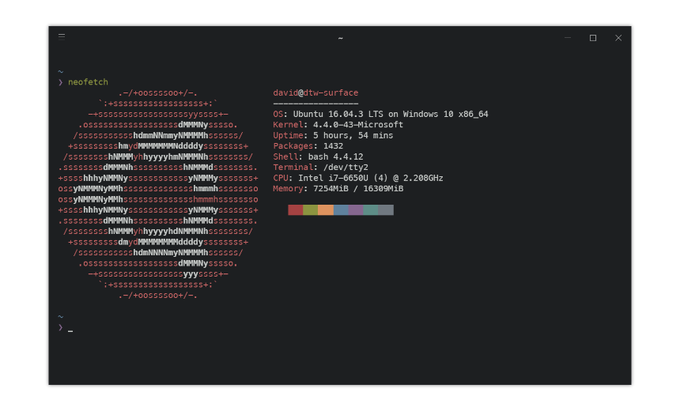

# dotfiles
[![license][license-badge]][license]
[![antibody][ab-badge]][ab]
[![vim-plug][vp-badge]][vp]
[![tpm][tpm-badge]][tpm]
[![say thanks][st-badge]][st]

<p align="center">
  
</p>

dotfiles configuration managed by [yadm](https://thelocehiliosan.github.io/yadm/). Originally created in Bash for Windows, has been tested on regular Ubuntu too. Contains:

- Vim/Neovim configuration
- tmux configuration
- Bash configuration
- zsh configuration
- Weechat configuration
- Custom Iosevka font
- ConEmu configuration

[license]: https://github.com/davidtwco/dotfiles
[license-badge]: https://img.shields.io/github/license/davidtwco/dotfiles.svg?style=flat-square
[ab]: https://github.com/getantibody/antibody
[ab-badge]: https://img.shields.io/badge/powered%20by-antibody-blue.svg?style=flat-square
[vp]: https://github.com/junegunn/vim-plug
[vp-badge]: https://img.shields.io/badge/powered%20by-vim--plug-blue.svg?style=flat-square
[tpm]: https://github.com/tmux-plugins/tpm
[tpm-badge]: https://img.shields.io/badge/powered%20by-tpm-blue.svg?style=flat-square
[st]: https://saythanks.io/to/davidtwco
[st-badge]: https://img.shields.io/badge/Say%20Thanks-!-1EAEDB.svg?style=flat-square

# How do I use these dotfiles?
dotfiles are managed using [yadm](https://thelocehiliosan.github.io/yadm).

In order to install yadm for your specific distro, [follow the installation instructions on the yadm documentation](https://thelocehiliosan.github.io/yadm/docs/install). To install on Ubuntu, follow the following instructions:

**Ubuntu 16.10 and up**
```
sudo apt install yadm
```

**Ubuntu 16.04 and lower**
```
sudo apt install -y software-properties-common
sudo add-apt-repository -y ppa:flexiondotorg/yadm
sudo apt update
sudo apt -y install yadm
```

Next, to use this repository, run the following:

```
yadm clone git@gitlab.com:davidtwco/dotfiles.git
```

This will clone the repository, you may have conflicts with pre-existing files like `.bashrc` - simply run `yadm status` and then `yadm reset HEAD <filename>` and `yadm checkout -- <filename>` to reset all files to those from the repository.

If you didn't run into any issues above, then yadm will have executed the [bootstrap script](.yadm/bootstrap) script to create symlinks and install plugins. If you need to run this manually, execute the following:

```
.yadm/bootstrap
```

## ZSH and Antibody
[Antibody](https://github.com/getantibody/antibody) is used for managing zsh plugins - this should be set up and installed by the bootstrap script. However, if it wasn't or you need to update the installed plugins, you can do the following:

First, if you haven't already, install Antibody as below:

```
curl -sL https://git.io/antibody | bash -s
```

Next, run the following to re-generate the `.zsh_plugins.sh` script that zsh will source to load plugins (you will need to redo this every time you change the [antibody bundle](.antibody_bundle) file that contains the list of plugins).

```
source <(antibody init)
bash -c 'antibody bundle < ~/.antibody_bundle > .zsh_plugins.sh'
antibody update
```

## Iosevka Font
If you wish to use the Iosevka font with these dotfiles, then you can [follow the instructions on the Iosevka repo](https://github.com/be5invis/Iosevka#installation) to download the font pre-built, or use the configuration files in the [iosevka folder](.yadm/iosevka) to [build the font from source](https://github.com/be5invis/Iosevka#build-your-own-style).

## Bash for Windows and ConEmu
It is recommended that ConEmu is used if you are using Bash for Windows. The [ConEmu configuration](.ConEmu.xml) is included in the repository and can be imported into ConEmu.

In order to use 256 colours, we need to use the WSL Bridge. The reasoning for this is explained below (excerpt from the [ConEmu documentation for Bash on Windows](https://conemu.github.io/en/BashOnWindows.html)):

> Despite the fact WSL binaries runs in Windows console window, they are not native Windows console applications (obviously) and they are not using native Windows Console API.

> When you run `%windir%\system32\bash.exe` this native Windows process starts ‘linux kernel’ outside of Windows console, and linux applications commuticate with conhost without use of Windows Console API.

> That means ConEmu can’t ‘hook’ linux processes! Unfortunately bash.exe which may be hooked is only a sort of a loader for WSL, bash.exe does not do console output and all ANSI sequences are processed before ConEmu can see them. WSL process all ANSI and writes stripped output directly to conhost.

> Another problem is that due to mistake in WSL design, keypresses written to conhost input buffer using standard Windows API function WriteConsoleInput are not converted into xterm keyboard sequences. But when user presses same key directly in RealConsole they are converted properly.

Therefore, we will need to do the following:

1. Create a folder to store WSLBridge files.
2. Download the latest release of the [Cygwin connector](https://github.com/Maximus5/cygwin-connector/releases).
3. Download the `wslbridge-*-cygwin64.tar.gz` file from the [wslbridge](https://github.com/rprichard/wslbridge/releases) project.
4. Get the `cygwin1.dll` file from a Cygwin or wsltty installation.
5. Ensure that `wslbridge.exe`, `cygwin1.dll`, `wslbridge-backend`, and `conemu-cyg-64.exe` files are in the previously created folder.
6. Create a new task in ConEmu (likely already done if using the included configuration file) with the following contents:

Setting                            | Value
-------                            | -----
Task (assuming folder is `C:\WSL`) | `C:\WSL\conemu-cyg-64.exe /cygdrive/c/WSL/wslbridge.exe -cur_console:p5nm:/mnt`
Task Parameters                    | `-icon "%USERPROFILE%\AppData\Local\lxss\bash.ico"`

## Hybrid Colour Scheme
There are registry scripts to configure the colour scheme of Windows' command prompt and default console to match the Hybrid colour scheme used by Vim. You can [find those scripts in the hybrid folder](.yadm/hybrid).
