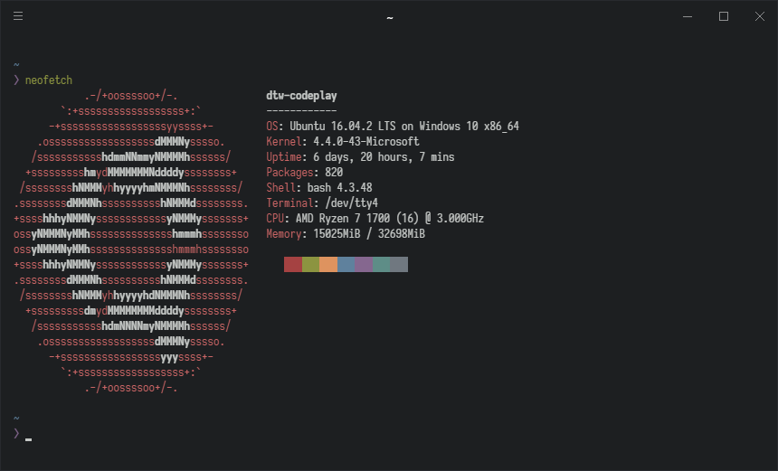

# dotfiles
[![license][license-badge]][license]
[![antibody][ab-badge]][ab]
[![vim-plug][vp-badge]][vp]
[![tpm][tpm-badge]][tpm]
[![say thanks][st-badge]][st]

dotfiles configuration managed by [yadm](https://thelocehiliosan.github.io/yadm/). Originally created in Bash for Windows, has been tested on regular Ubuntu too. Contains:

<p align="center">
  
</p>

- Vim/Neovim configuration
- tmux configuration
- Bash configuration
- zsh configuration
- Weechat configuration
- Custom Iosevka font
- ConEmu configuration

[license]: https://github.com/davidtwco/dotfiles
[license-badge]: https://img.shields.io/github/license/davidtwco/dotfiles.svg?style=flat-square
[ab]: https://github.com/getantibody/antibody
[ab-badge]: https://img.shields.io/badge/powered%20by-antibody-blue.svg?style=flat-square
[vp]: https://github.com/junegunn/vim-plug
[vp-badge]: https://img.shields.io/badge/powered%20by-vim--plug-blue.svg?style=flat-square
[tpm]: https://github.com/tmux-plugins/tpm
[tpm-badge]: https://img.shields.io/badge/powered%20by-tpm-blue.svg?style=flat-square
[st]: https://saythanks.io/to/davidtwco
[st-badge]: https://img.shields.io/badge/Say%20Thanks-!-1EAEDB.svg?style=flat-square

# How do I use these dotfiles?
dotfiles are managed using [yadm](https://thelocehiliosan.github.io/yadm).

In order to install yadm for your specific distro, [follow the installation instructions on the yadm documentation](https://thelocehiliosan.github.io/yadm/docs/install). To install on Ubuntu, follow the following instructions:

**Ubuntu 16.10 and up**
```
sudo apt install yadm
```

**Ubuntu 16.04 and lower**
```
sudo apt install -y software-properties-common
sudo add-apt-repository -y ppa:flexiondotorg/yadm
sudo apt update
sudo apt -y install yadm
```

Next, to use this repository, run the following:

```
yadm clone git@gitlab.com:davidtwco/dotfiles.git
```

This will clone the repository, you may have conflicts with pre-existing files like `.bashrc` - simply run `yadm status` and then `yadm reset HEAD <filename>` and `yadm checkout -- <filename>` to reset all files to those from the repository.

If you didn't run into any issues above, then yadm will have executed the [bootstrap script](.yadm/bootstrap) script to create symlinks and install plugins. If you need to run this manually, execute the following:

```
.yadm/bootstrap
```

## ZSH and Antibody
[Antibody](https://github.com/getantibody/antibody) is used for managing zsh plugins - this should be set up and installed by the bootstrap script. However, if it wasn't or you need to update the installed plugins, you can do the following:

First, if you haven't already, install Antibody as below:

```
curl -sL https://git.io/antibody | bash -s
```

Next, run the following to re-generate the `.zsh_plugins.sh` script that zsh will source to load plugins (you will need to redo this every time you change the [antibody bundle](.antibody_bundle) file that contains the list of plugins).

```
source <(antibody init)
bash -c 'antibody bundle < ~/.antibody_bundle > .zsh_plugins.sh'
antibody update
```

## Iosevka Font
If you wish to use the Iosevka font with these dotfiles, then you can [follow the instructions on the Iosevka repo](https://github.com/be5invis/Iosevka#installation) to download the font pre-built, or use the configuration files in the [.iosevka folder](.iosevka) to [build the font from source](https://github.com/be5invis/Iosevka#build-your-own-style).

## Bash for Windows and ConEmu
It is recommended that ConEmu is used if you are using Bash for Windows. The [ConEmu configuration](.ConEmu.xml) is included in the repository and can be imported into ConEmu.

## Hybrid Colour Scheme
There are registry scripts to configure the colour scheme of Windows' command prompt and default console to match the Hybrid colour scheme used by Vim. You can [find those scripts in the .hybrid folder](.hybrid).
